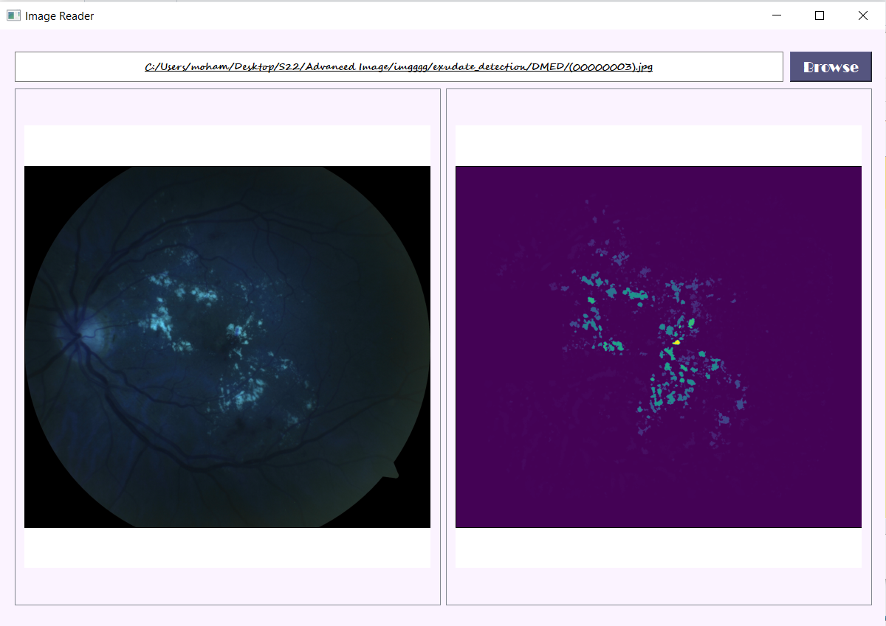
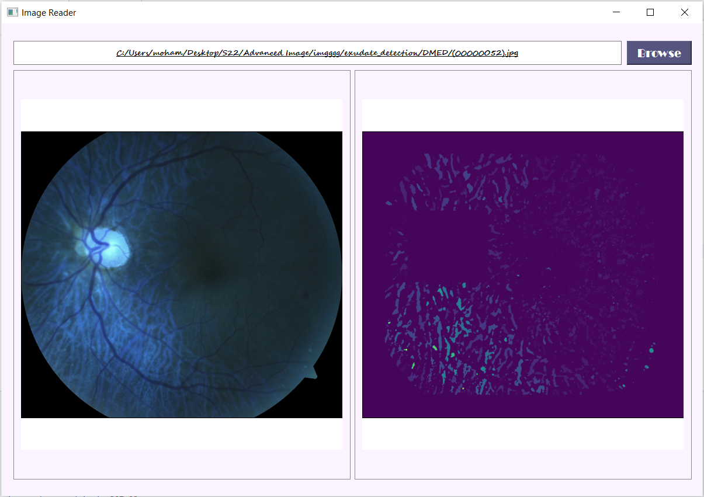

# Exudate_Detection

### How to use
- Run main.py
- Click the browse button and choose a photo
- Wait until both images appear (original & exudates)

#### Function Used
- Browse(): Browse an image to extract its exudates.
- getONloc(): [onRow, onCol] Get the hand identified location of the optic nerve.
- showLesions(img,removeON, onY, onX) Display the image indicated by imgID with the lesions.
- findGoodResolutionForWavelet(size):
- getFovMask(img, erodeFlag, seSize): Construct Field of view mask for the eye.
- get_median_filt(img, newSize): Smooth the image.
- get_reconstructed_bkg(img, medBg): 
- get_subtracted_img(img, medBg, imgFovMask)

#### Liked it?
Hope you liked this project, don't forget to give it a star ⭐